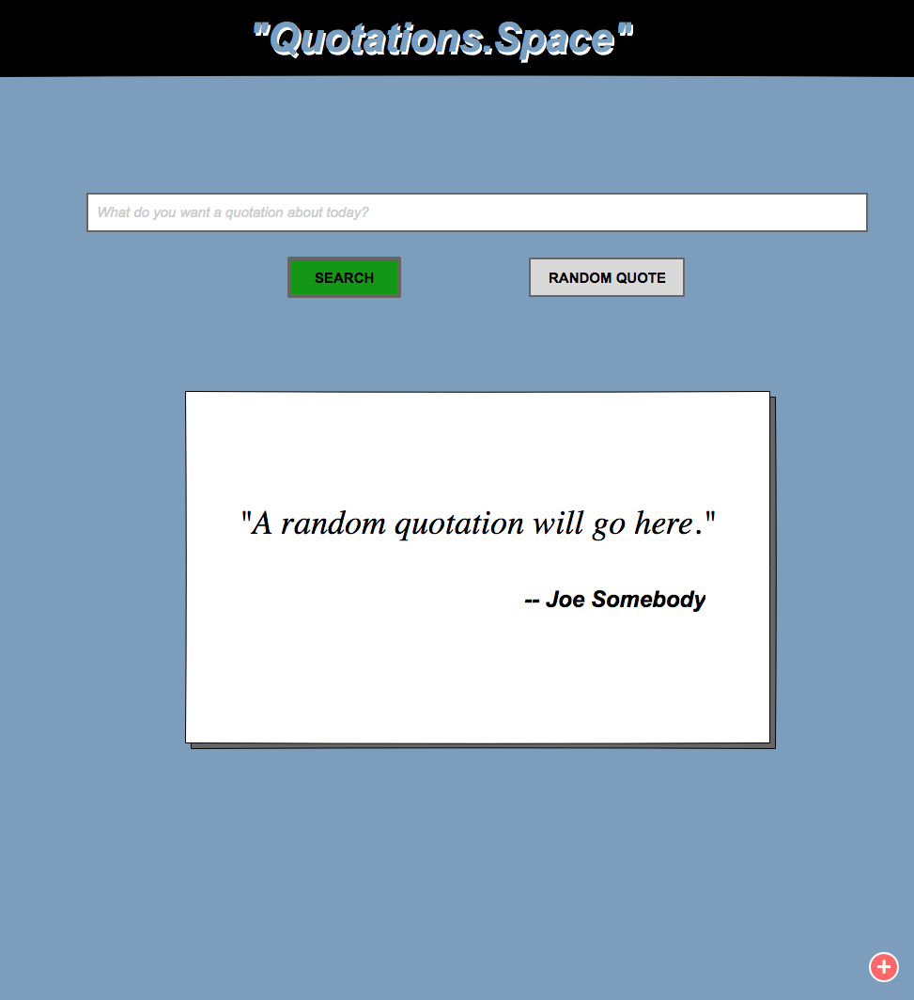

# Full Stack Development Course Milestone Project #4 of 4

## MAY 2021

Student: [Bill Davis](http://www.williambdavisjr.com)

* Email: [bill.davis@gmail.com](bill.davis@gmail.com)

PROJECT GIT REPOSITORY:

* [https://github.com/billdavisjr/wbd_fsd_project4](https://github.com/billdavisjr/wbd_fsd_project4)

This is the fourth milestone project for my Code Institute Full Stack Developer Course.

Unfortunately, because I lost my previous job, had to find and start a new one, and due to a family emergency, I lost a lot of time and
was not able to finish this project in the time available.  I am taking this course as a continuing education course after working hours
and I just did not have enough time available. I am proving what I have done, rather than submitting nothing.

CONCEPT:

We've all seen quotations in books, hung on a wall, as an e-mail signature, or used in a presentation.

This site is a quotations database and search engine, with categorizations and ratings. It's useful to search for quotations
about a topic for many purposes, such as those described earlier. Searching the database is free, but with a user subscription
you can maintain a list of favorite and add your on quotes to the database.

This site is a recreation of the third milestone project (which was done with Python3 and Flask) using Python3 and Django
instead, and adding features such as:

* User accounts and authentication
* Annual Subscriptions you can purchase to let you store your favorites and to add your own quotes.
* Credit card support for subscription purchases using Stripe.

I have many additional plans and ideas for this site as well (detailed elsewhere) that will not be a part of this
project, but will be implemented later. Eventually I hope to monetize this site even further,  by selling merchandize or posters with the quotes & sayings printed on them,with photographic or other backgrounds, possibly using a site such as Cafe Press or RedBubble if I can find one that has an API that lets me submit artwork generated by the site, to be produced into things like posters, mugs, t-shirts,  masks, and so on.

PREVIOUS VERSION OF THIS SITE FROM THIRD MILESTONE PROJECT

* [https://wbd-fsd-project3.herokuapp.com/](https://wbd-fsd-project3.herokuapp.com/)

PREVIOUS VERSION GIT REPOSITORIES

* [https://github.com/billdavisjr/wbd_fsd_project3.git](https://github.com/billdavisjr/wbd_fsd_project3.git)

* [https://git.heroku.com/wbd-fsd-project3.git](https://git.heroku.com/wbd-fsd-project3.git)

---

## UX - USER EXPERIENCE

Use this section to provide insight into your UX process, focusing on who this website is for, what it is that they want to
achieve and how your project is the best way to help them achieve these things.

### USER STORIES

User stores are statements of the form "As a *user type*, I want to perform an *action*, so I can achieve a *goal*.

* As a collector of quotes, I want to store my quotes in a database, so I can access them anywhere.

* As a fan of quotes, I want to be able to search for a quote using a few words, so I can find it and use it.

* As a write, I need to be able to search for quotes by category or keyword, so I can start a chapter or section with an appropriate quote.

* As someone who is putting together a presentation, I need to be able to search for a relevant quote, so that I can put it in my presentation.

* As a user of this site I need to be able to favorite quotes in the site's database so I can find them again (a simple form of having your own list of quotes)

* As a user of this site I need to be able to keep a database of my own quotes including favoriting them and rating them.

### FUTURE

* As someone wanting a gift for a friend, I want to find or add a quote relevant to my friend, then have it put on a poster, t-shirt or coffee mug.

---

## DESIGN

DATABASE / DJANGO MODELS

    Category  - the type/subject of the quote
        - id (PK - unique) 
        - name
        - display_name

    Public Quotes
        - id (private key) - unique
        - Owner (null) - not visible to users
        - UniqueID
        - Text
        - Person 
        - Category id (foreign key)
        - Source
        - DateSaid
        - Favorite (boolean)
        - Star Rating (float 0.0-5.0 in .5 increments) - not settable by users except sys admin

To load the above database tables with data, fixtures are available.  From the command line do the following, in this order;
It is important to do them in the right order:

$ python3 manage.py loaddata categories
$ python3 manage.py loaddata quotations

dNOT YET CREATED:

    User Rating (of public. quotes)
        - User id
        - Quote id (foreign key)
        - Favorite (boolean)
        - Star Rating (float - 0.0 to 5.0)
        
    Subscription
        - Date purchased
        - Term 
            - Trial $0 (1 month)
            - Yearly $5 (100 quotes)
            - Lifetime $50 (1000 quotes)
            - Unlimited $100 (unlimited)
        - Type
            - None (not an actual type)
                You can search for quotes in the public database and that's all
                    - you don't have a subscription or and account; ANYONE gets this much.
            - Basic
                - you can favorite quotes in the public database
            - Full
                - add your own quotes
                - star ratings (0.0-5.0) for your own quotes
                - favorite your own quotes
                - favorite public quotes

## WIREFRAMES

This section is also where you would share links to any wireframes, mockups, diagrams etc. that you created as part of
the design process. These files should themselves either be included as a pdf file in the project itself (in an
separate directory), or just hosted elsewhere online and can be in any format that is viewable inside the browser.

### MAIN PAGE - SEARCH ENGINE

Just like other web search engines, you type in some text and click search. You'll be taken to a search results page.
This page also lets you click "Random Quote" to display a nicely formatted random quote in the text box below the Search
field. That box will also be filled with a random quote each time the page is loaded.  The logo at the top will have a
moving starfield behind it such as what you'd see in a science fiction movie or TV show.  I actually own the domain names
quotations.space and quotation.space (singular) for use with this site, along with quoogle.com (like google, but starting
with 'quo' instead of 'goo') but am not sure I want to risk using a domain name so similar, to avoid legal hassles.

* Search results - card viewable
* Search results - list viewable
* Search results - random button

* Categories
* Add Category (admin ONLY)
* Edit Category (admin ONLY)

* Add quote
* Edit quote
* Full screen quote display

* Account creation
* Account editing

* Subscription sign up
  * trial
  * basic
    * (favorite/rate quotes @ $5/yr)
FUTURE
  * full
    * add/edit own quotes with their own favorite status and star rating ($25/yr)
    * Lifetime ($100 for life)
    * Unlimited?

## Features

In this section, you should go over the different parts of your project, and describe each in a sentence or so.

### Existing Features

* Feature 1 - allows users X to achieve Y, by having them fill out Z
* ...

For some/all of your features, you may choose to reference the specific project files that implement them, although this is
entirely optional.

In addition, you may also use this section to discuss plans for additional features to be implemented in the future:

### Features Left to Implement

* Another feature idea

## Technologies Used

In this section, you should mention all of the languages, frameworks, libraries, and any other tools that you have used to construct this project. For each, provide its name, a link to its official site and a short sentence of why it was used.

* [Python3]

* [Django]

### Django frameworks

See the requirements.txt file for all frameworks used; some are called by other frameworks we use directly and are added to the requirements.txt file using the command `$pip3 freeze >requirements.txt` and they can be installed by `pip3 install -r requirements.txt` or individually by `pip3 install <name of framework>` e.g. `pip3 install db_database_url`

Used for PostgreSQL support (when deployed on Heroku where that is used instead of SQLite)

* sycopg2-binary
* dj_database_url

Authentication

* django-allauth - Allauth, used for user loging/authentication

Other

* gunicorn - our web server
* boto3 -
* django_storages -

### JavaScript Frameworks

* [JQuery](https://jquery.com)
  * The project uses **JQuery** to simplify DOM manipulation.

* [Bootstrap](https://getbootstrap.com/)
  * The project uses **Bootstrap** for CSS formatting of our page GUIs.

* [FontAwesome](https://fontawesome.com/)
  * We use FontAwesome for the various icons on our site.

* [Google Fonts](https://fonts.google.com/)
  * We use the Google Fonts API for our site fonts (Lato, etc.)

### WIREFRAME TOOLS

* [Balsamiq](https://balsamiq.com/wireframes/)
  * Wireframes for the design of the various pages were created in the popular Balsamiq wireframe tool; Code Institute gives
  students a free license to use it for a year (at present, anyway).

* [Figma](https://www.figma.com)
  * Web-based wireframe tool with a free tier; used because Balsamiq had a free key through
    Code Institute that expired at the end of the year, when meant it was going to expire in the middle of the design process
    and when the Code Institute staff was out of the office over the holidays.  Stopped using Figma when Code Institute sent us
    a key for Balsamiq for 2021.

* [Pencil](https://pencil.evolus.vn/)
  * Another wireframe tool that I investigated before going back to Balsamiq.

### OTHER TOOLS / SERVICES

* [GitHub]

* [GitPod]

* [Heroku]

* [SqlLite3]
  * used by Django for the development server database

* [PostgreSQL]
  * used in production on Heroku to replace the Sqlite 3 database Django normally uses.

* [AWS - Amazon Web Services](http://aws.amazon.com/)
  * we use Amazon Web Services to <<<<< FILL IN THE REASONS >>>>>

* Syntax checkers and Linters on GitPod are used to keep the code clean, correct and consistently styled for best practices.
  * markdownlint
  * cornflakes

I attempted to use tools such as [TinyJPG](https://tinyjpg.com/) to shrink the size of the background graphic (yellow with a book at
the bottom) but got too much banding of the yellow background and so did it myself using a graphics program and shrinking it myself.
I got it down to about 50% of the original size, at least, before JPEG compression artifacts started banding the yellow background.

## FAVICON

To add a favicon.ico to a Django app so it has a distinctive icon in the web browser window/tab, I found information at:

<https://simpleit.rocks/python/django/django-favicon-adding/>

## SCRIPTS

I created several shell scripts to make development easier, backup/restore the database etc.  These can be found in the /scripts folder.

### DATABASE DUMP RESTORE

These were inspired by a note in the course on getting your data into PostgreSQL in Heroku if you didn't create fixtures (though I have).
These could also be useful in creating final fixtures, since I moved data over from an Excel spreadsheet of quotes and might make fixes or other changes to the quotes once they are in the database on my development machine.

* dumpdb.sh - dumps the database to a file named db.json in the root of the project, pretty printed through command line tool json_pp
* loaddb.sh - loads the database from db.json into db.sqlite3.

## DATA CLEANUP

* Microsft Excel
  * my "database" of quotations has been kept in a simple text file for years, because it's fast and easy to add quotes to the end. It's also each to move to different platforms, as I have done repeatedly over many years when learning a new programming language or p  latform. Also, a text filke can be used with any system. It's been fast enough in practice, even with over 10,000 quotes, and reading them into an in-memory array makes it speedy.  But for this project I wanted a database so I used Excel to clean up the text file into rows and columns of data. I also use Microsoft Visual Basic for Applications (VBA) to write some code  to do some of the cleanup and export the quotatio data in JSON format for import into the SQL database.

## TESTING

<<<
In this section, you need to convince the assessor that you have conducted enough testing to legitimately believe that the
site works well. Essentially, in this part you will want to go over all of your user stories from the UX section and ensure
that they all work as intended, with the project providing an easy and straightforward way for the users to achieve their
goals.

Whenever it is feasible, prefer to automate your tests, and if you've done so, provide a brief explanation of your approach,
link to the test file(s) and explain how to run them.

For any scenarios that have not been automated, test the user stories manually and provide as much detail as is relevant.
A particularly useful form for describing your testing process is via scenarios, such as:

1. Contact form:
    1. Go to the "Contact Us" page
    2. Try to submit the empty form and verify that an error message about the required fields appears
    3. Try to submit the form with an invalid email address and verify that a relevant error message appears
    4. Try to submit the form with all inputs valid and verify that a success message appears.

In addition, you should mention in this section how your project looks and works on different browsers and screen sizes.

RESPONSIVE TESTING

    DESKTOP
    * Desktop computer
        * 2560 x 1440 (Apple iMac)
        * Google Chrome Developer Tool screen size emulation

    MOBILE
    * iPhone 11 Pro Max
    * iPhone 4s
    * iPad Air
    * iPad mini

## BUGS

You should also mention in this section any interesting bugs or problems you discovered during your testing, even if you haven't
addressed them yet. If this section grows too long, you may want to split it off into a separate file and link to it from here.

## DEPLOYMENT

This section should describe the process you went through to deploy the project to a hosting platform (e.g. GitHub Pages
or Heroku). In particular, you should provide all details of the differences between the deployed version and the development version,
if any, including:

* Different values for environment variables (Heroku Config Vars)?
* Different configuration files?
* Separate git branch?

In addition, if it is not obvious, you should also describe how to run your code locally.

### LOCAL CODE DEPLOYMENT

* [GitPod](https://gitpod.io/)
  * Use Code Institute GitHub template (fork it) to set up a new GitPod environment and then check out a fork of this code into it.

## CREDITS

### Content

* The text for section Y was copied from the [Wikipedia article Z](https://en.wikipedia.org/wiki/Z)

### Media

* The photos used in this site were obtained from the following source(s):
  * Page background image from Pexels.com by [Stas Knop](https://www.pexels.com/@stasknop) can be found [here](https://www.pexels.com/photo/white-book-in-white-table-near-yellow-wall-3760323/)

### Acknowledgements

* The template for this README file came from a [template](https://github.com/Code-Institute-Solutions/readme-template) from Code Institute.
The README file for that is at the end of this README file.

* Some code in the base.css file (the .icon class) came from [Bulma](https://bulma.io/), a CSS framework similar to Bootstrap

* Creating the scrollable CATEGORY dropdown menu used the CSS from this code example: [Bootstrap Scrollable Dropdown Menu](https://www.codeply.com/go/Uh8qadr3q2/bootstrap-scrollable-dropdown-menu)

---

## THE FOLLOWING IS THE README.MD FILE FROM THE [CODE INSTITUTE GITPOD REPOSITORY TEMPLATE](https://github.com/Code-Institute-Org/gitpod-full-template)

If you have difficulty checking out the code and having it compile for some reason, fork the above
template, create a new GitPod workspace from it by adding <https://gitpod.io/#>
to the front of your forked repository URL, then once the code in the repository that runs when you
open in it GitPod has set up the environment, copy over the source code for this project and replace
the GitPod template code.  You might want to remove all the git related hidden directories/files first.

---

Welcome Bill Davis,

This is the Code Institute student template for Gitpod. We have preinstalled all of the tools you need to get started.
You can safely delete this README.md file, or change it for your own project. Please do read it at least once, though!
It contains some important information about Gitpod and the extensions we use.

## Gitpod Reminders

To run a frontend (HTML, CSS, Javascript only) application in Gitpod, in the terminal, type:

`python3 -m http.server`

A blue button should appear to click: *Make Public*,

Another blue button should appear to click: *Open Browser*.

To run a backend Python file, type `python3 app.py`, if your Python file is named `app.py` of course.

A blue button should appear to click: *Make Public*,

Another blue button should appear to click: *Open Browser*.

In Gitpod you have superuser security privileges by default. Therefore you do not need to use the `sudo` (superuser do) command in the bash terminal in any of the lessons.

## Updates Since The Instructional Video

We continually tweak and adjust this template to help give you the best experience. Here is the version history:

**October 21 2020:** Versions of the HTMLHint, Prettier, Bootstrap4 CDN and Auto Close extensions updated. The Python extension needs to stay the same version for now.

**October 08 2020:** Additional large Gitpod files (`core.mongo*` and `core.python*`) are now hidden in the Explorer, and have been added to the `.gitignore` by default.

**September 22 2020:** Gitpod occasionally creates large `core.Microsoft` files. These are now hidden in the Explorer. A `.gitignore` file has been created to make sure these files will not be committed, along with other common files.

**April 16 2020:** The template now automatically installs MySQL instead of relying on the Gitpod MySQL image. The message about a Python linter not being installed has been dealt with, and the set-up files are now hidden in the Gitpod file explorer.

**April 13 2020:** Added the _Prettier_ code beautifier extension instead of the code formatter built-in to Gitpod.

**February 2020:** The initialisation files now _do not_ auto-delete. They will remain in your project. You can safely ignore them. They just make sure that your workspace is configured correctly each time you open it. It will also prevent the Gitpod configuration popup from appearing.

**December 2019:** Added Eventyret's Bootstrap 4 extension. Type `!bscdn` in a HTML file to add the Bootstrap boilerplate. Check out the [README.md](https://github.com/Eventyret/vscode-bcdn) file at the official repo</a> for more options.

---

Happy coding!
